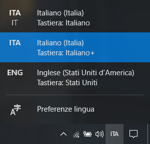
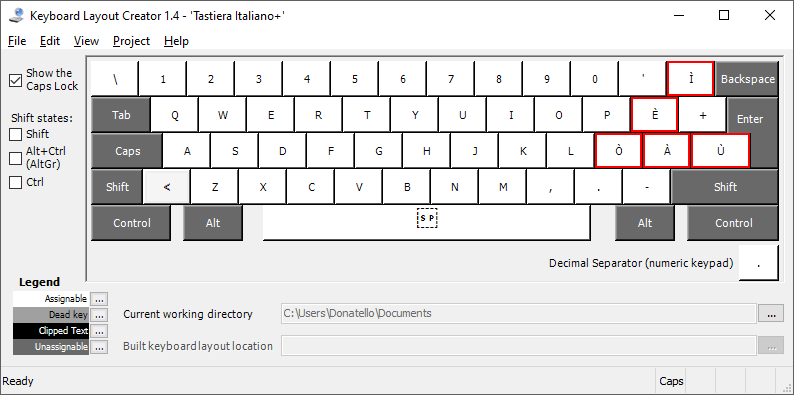
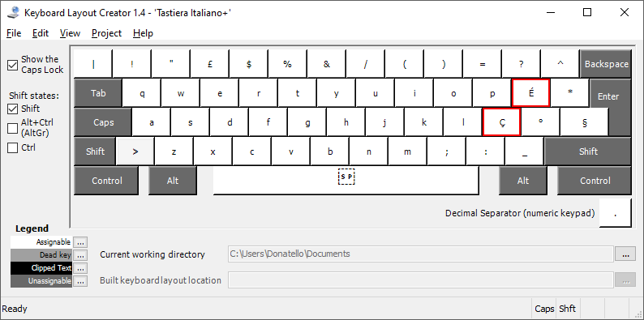

# Tastiera Italiano+
Il layout italiano della tastiera di Windows è davvero molto **limitato**, più in particolare mancano tutte le **vocali accentate maiuscole**. 
È possibile arginare il problema con i **codici ASCII** (Alt+NumPad), ma c'è bisogno di doverli ricordare tutti.

Il setup qui presente aggiunge un **layout personalizzato**, basato su quello originale italiano. 
Nota bene che **non** sovrascrive alcun carattere già presente nella tastiera italiana, ma ne aggiunge soltanto di nuovi.

Il layout è stato creato con **[Microsoft Keyboard Layout Creator (MSKLC) v1.4](https://www.microsoft.com/en-us/download/details.aspx?id=102134)**.

**In questo layout, che ho chiamato "Italiano+", sono presenti tutte le vocali accentate maiuscole più altri caratteri speciali che possono tornare utili.** I caratteri speciali aggiuntivi sono inseriti in punti intuitivi e facili da ricordare.

## Installazione e attivazione
Scaricare il contenuto del repository (*Code>Download ZIP*), decomprimerlo ed aprire "**Tastiera Italiano+/setup.exe**. 
L'installazione dura pochi secondi.

In seguito, aprire il selettore delle **preferenze di lingua** su Windows e selezionare "**Italiano+**":

## Vantaggi
La tastiera aggiunge i seguenti caratteri:

• **CAPS LOCK:** 

• **CAPS LOCK + SHIFT:** 

• **ALT GR:** 

• **ALT GR + SHIFT:** 

